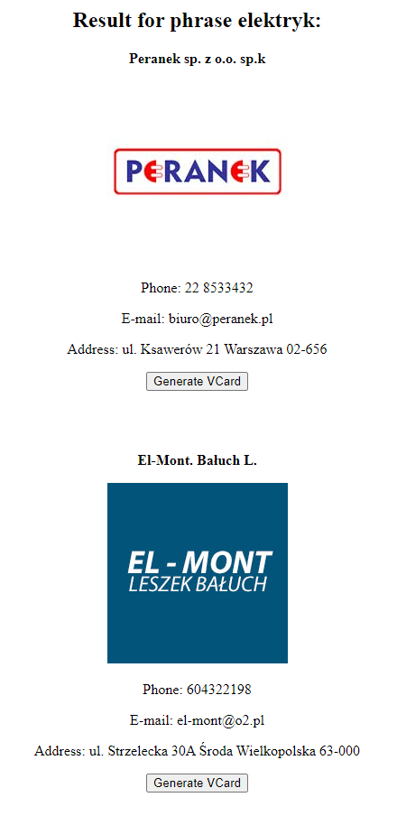

# VCard API for Panorama Firm
REST API to display data about workers and company and makes it possible generate VCard 
## Usage

To use API you must send GET request to selected endpoint(for example: "elektryk").
#### Syntax
````
path_to_API/{text}
````
# Examples:
Request:
````
http://localhost:8080/VCardController/elektryk
````



After click button "generate VCard" download file VCF with this specialist which we can import to our mobile contacts